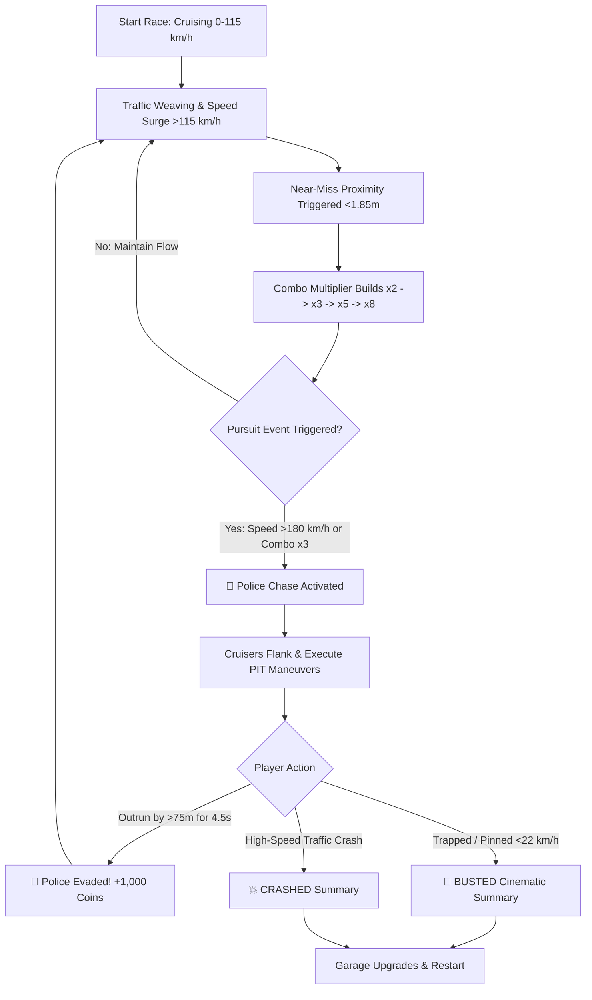

# ⚡ VELOCITY X — Product Requirement Document (PRD)

> **Document Classification**: Product Master Specification (PRD-001)  
> **Target Audience**: Product Managers, 3D Graphics Engineers, Mobile Gameplay Developers, QA  
> **Target Platforms**: 100% Mobile-First (All Android & iOS Smartphones & Tablets)  
> **Game Genre**: 3D Photorealistic WebGL Highway Pursuit Racer  
> **Offline Engine**: Cache-First Progressive Web App (PWA) Engine  
> **Last Updated**: September 20, 2026 | Version 2.0 (Executive Edition)  

---

## 1. Executive Product Vision & Value Proposition

### 1.1 The Core Problem in Modern Mobile Gaming
Traditional mobile 3D racing games (e.g., *Asphalt 9*, *Need for Speed: No Limits*, *Real Racing 3*) suffer from massive friction:
- **Massive Storage Bloat**: Require 2.5 GB to 4.5 GB app store downloads.
- **Forced Online Connectivity**: Disconnect or refuse to launch in **Airplane Mode** or during low-signal commutes.
- **Aggressive Monetization Friction**: Unskippable 30-second video advertisements, pay-to-win energy timers, and invasive device tracking permissions.
- **Excessive Thermal Throttling**: Heavy engines melt mobile batteries and drop frames within 5 minutes of play.

### 1.2 The VELOCITY X Solution
**VELOCITY X** reimagines mobile racing as an ultra-fast, zero-friction web application:
- **Instant 1-Second Launch**: Total production bundle is **under 190 KB (gzip)**. It loads faster than an Instagram post.
- **Zero Asset Downloads**: Built with **100% Procedural Web Audio API** and **Procedural Canvas Textures**. 0 MB MP3s, 0 external image files.
- **100% Offline in Airplane Mode**: The Cache-First Service Worker enables seamless play on flights, subways, and remote areas with zero internet.
- **"Makhan Ki Tarah" 60–120 FPS**: Zero Garbage Collection in the render loop, DPR clamping (1.75 max), and object pooling lock the frame rate at device refresh rate (60Hz, 90Hz, 120Hz ProMotion).

```
┌──────────────────────────────────────────────────────────────────────────────────────────┐
│                             THE VELOCITY X VALUE TRIANGLE                                │
├──────────────────────────────────────────────────────────────────────────────────────────┤
│                                                                                          │
│                         ⚡ INSTANT ACCESS (<190 KB, 1-SEC LAUNCH)                        │
│                                      ▲                                                   │
│                                     / \                                                  │
│                                    /   \                                                 │
│                                   /     \                                                │
│                                  /       \                                               │
│                                 /         \                                              │
│                                /           \                                             │
│       🏎️ AAA PHOTOREALISM (PBR) ◄───────────► ✈️ 100% OFFLINE (AIRPLANE MODE)           │
│       Clearcoat Automotive Finish            Zero Cellular Data / Zero Ads               │
│                                                                                          │
└──────────────────────────────────────────────────────────────────────────────────────────┘
```

---

## 2. Target User Personas & Hardware Tier Matrix

### 2.1 User Personas

| Persona | Demographics & Habits | Primary Needs | How VELOCITY X Delivers |
| :--- | :--- | :--- | :--- |
| **"The Metro Commuter"** | Age 18–34, travels daily via underground metro or train with intermittent 4G/5G signal. | Instant entertainment, zero loading lag, offline capability. | Opens from home-screen icon instantly; plays in full offline mode when entering tunnels. |
| **"The Flight Traveler"** | Business or leisure flyer on long flights without paying for $20 in-flight WiFi. | Engaging, high-adrenaline game that works in Airplane Mode. | 100% self-contained PWA engine with local persistence. |
| **"The Hardware Purist"** | Tech enthusiast with a 120Hz display (iPhone Pro / Galaxy Ultra) who hates frame drops. | Silky 120 FPS, responsive multi-touch controls, dynamic visual feedback. | Clamped DPR, zero GC in tick, and ProMotion 120Hz native render loop. |

### 2.2 Device Performance Tier Matrix

```
┌──────────────────────────────────────────────────────────────────────────────────────────┐
│                                HARDWARE PERFORMANCE PROFILES                             │
├───────────────────────┬──────────────────────────────────┬───────────────────────────────┤
│ HARDWARE TIER         │ REPRESENTATIVE DEVICES           │ TARGET PERFORMANCE & SETTINGS │
├───────────────────────┼──────────────────────────────────┼───────────────────────────────┤
│ Tier 1: Entry/Budget  │ Redmi 12, Realme C-series,       │ • Locked 60 FPS               │
│ (Mali / Adreno 610)   │ Samsung Galaxy A14               │ • DPR Clamped to 1.25         │
│                       │                                  │ • Battery Drain: < 4% / 30min │
├───────────────────────┼──────────────────────────────────┼───────────────────────────────┤
│ Tier 2: Mid-Range     │ OnePlus Nord, Galaxy A54,        │ • Locked 60–90 FPS            │
│ (Adreno 700 / Apple)  │ iPhone 11, 12, 13, 14 Base       │ • DPR Clamped to 1.50         │
│                       │                                  │ • Full Volumetric Cones       │
├───────────────────────┼──────────────────────────────────┼───────────────────────────────┤
│ Tier 3: Flagship/Pro  │ iPhone 14/15/16 Pro,             │ • Locked 90–120 FPS           │
│ (A17/A18, Snapdragon) │ Galaxy S23/S24 Ultra, Pixel 8/9  │ • DPR Clamped to 1.75         │
│                       │                                  │ • ACES Filmic Tone Mapping    │
└───────────────────────┴──────────────────────────────────┴───────────────────────────────┘
```

---

## 3. The Core Gameplay Loop (Minute-to-Minute Experience)

The game delivers an escalating rhythm of risk vs. reward, transitioning through 4 distinct adrenaline phases:



### 3.1 Phase 1: High-Speed Cruise & Lane Navigation (0–115 km/h)
- The player begins in Lane 2 on an infinite 4-lane cyber highway.
- Acceleration is smooth and progressive with simulated 6-speed automatic transmission.
- Civilian vehicles navigate lanes at speeds ranging from 75 to 110 km/h.

### 3.2 Phase 2: Near-Miss Multipliers & Combo Chains (> 115 km/h)
- Once the player crosses 115 km/h, the **Proximity Near-Miss Detection System** goes live.
- Slicing past a civilian car within **1.85 meters** triggers:
  - Electric banner: **`NEAR MISS! +150 PTS`**.
  - Procedural frequency-swept whoosh audio.
  - 18ms crisp haptic vibration tick on Android.
  - Multiplier increment: **`x1` → `x2` → `x3` → `x5` → `x8`**.
  - A 3.8-second circular decay timer starts. Slicing past another vehicle resets the timer and prolongs the streak.

### 3.3 Phase 3: Nitrous Oxide (NOS) Rocket Propulsion
- Holding the cyan glowing NOS button on the right thumb injects nitrous oxide:
  - Top speed surges from standard maximum up to **295–320 km/h**.
  - Acceleration jumps to **65 km/h per second**.
  - Camera FOV smoothly expands from **68° to 92°**, creating intense peripheral motion blur and warp.
  - Dual titanium exhaust tips emit high-velocity electric blue/cyan particle fire.
  - Procedural turbo hiss and blow-off valve release (`pshhhh`) plays upon releasing the button.
  - NOS drains in ~4.5 seconds; passively regenerates when cruising at speeds above 100 km/h.

### 3.4 Phase 4: High-Speed Police Chase & PIT Maneuvers
- Reaching high sustained speeds (> 180 km/h) or hitting a high combo streak trips the **Highway Patrol Pursuit Alarm**.
- **Tactical Visual & Audio Cues**:
  - Screen edges pulse violently with alternating **Red & Blue 8 Hz emergency strobes**.
  - The tactical rearview mirror illuminates with approaching cruiser silhouettes.
  - Dual-tone wailing siren audio sweeps from behind with dynamic spatial stereo panning.
- **Interceptor AI Behavior**:
  - Two Black & White interceptor cruisers with heavy steel bullbars surge from behind at speeds up to 280 km/h.
  - The lead cruiser matches the player's lateral coordinate and attempts **PIT maneuvers** (ramming the rear quarter-panel to spin or push the player into heavy traffic).
  - Support cruiser flanks adjacent lanes to block evasive maneuvers.
- **Pursuit Resolutions**:
  - **EVADED**: Weaving through dense traffic or hitting NOS to pull > 75 meters ahead of cruisers for 4.5 seconds triggers **`🚨 POLICE EVADED! +1,000 BONUS REWARD`**.
  - **BUSTED**: Being pinned against guardrails or boxed into traffic such that vehicle speed drops below 22 km/h triggers the dramatic **`BUSTED!`** sequence.
  - **CRASH**: Colliding head-on with heavy tanker trucks or civilian cars during pursuit triggers an explosive crash sequence with flying sparks and screen shake.

---

## 4. Vehicle Roster, Telemetry & Customization Garage

```
┌──────────────────────────────────────────────────────────────────────────────────────────┐
│                                SUPERCAR SPECIFICATION MATRIX                             │
├───────────────────┬───────────────────┬───────────────────┬──────────────────────────────┤
│ SPECIFICATION     │ ⚡ APEX ROADSTER   │ 🏎️ VELOCE GT       │ 🦾 TITAN V8 MUSCLE           │
├───────────────────┼───────────────────┼───────────────────┼──────────────────────────────┤
│ Tier / Price      │ Starter (FREE)    │ 3,500 Coins       │ 5,000 Coins                  │
│ Archetype         │ Agile Track Toy   │ Aero Speed Demon  │ Heavy Enforcer               │
│ Top Speed         │ 240 KM/H          │ 295 KM/H          │ 260 KM/H                     │
│ Nitro Max Speed   │ 290 KM/H          │ 360 KM/H          │ 315 KM/H                     │
│ Acceleration (0-10)│ 9.2               │ 9.8               │ 8.5                          │
│ Handling (0-10)   │ 9.5 (Hyper-Agile) │ 8.8 (Precise)     │ 7.5 (Drift-Heavy)            │
│ Armor vs Police   │ 6.0 (Moderate)    │ 5.5 (Fragile)     │ 9.5 (Ramming Juggernaut)     │
│ Best Suited For   │ Micro-weaving     │ Long straightaways│ Counter-ramming cruisers     │
└───────────────────┴───────────────────┴───────────────────┴──────────────────────────────┘
```

### 4.1 Metallic Clearcoat Paint Shop
All vehicle bodies utilize `MeshPhysicalMaterial` with:
- `metalness: 0.85`
- `roughness: 0.18`
- `clearcoat: 1.0`
- `clearcoatRoughness: 0.08`
- `reflectivity: 0.9`

**Available Finishes**:
1. ⚡ **Cyber Cyan** (`#00f3ff`) — High-voltage electric neon.
2. 🖤 **Midnight Obsidian** (`#11141a`) — Stealth carbon black.
3. 🏎️ **Crimson Flare** (`#ff0044`) — Aggressive racing scarlet.
4. 👑 **Liquid Gold** (`#e6c300`) — Deep lustrous metallic amber.
5. 🧪 **Toxic Lime** (`#22ff44`) — Hyper-saturated lime pearl.
6. 🔮 **Ultraviolet** (`#a822ff`) — Cyberpunk royal violet.

### 4.2 RGB Neon Ground Underglow
Simulates real-time ground illumination with a double-pass system (projected planar decal + dynamic point light):
1. ❄️ **Ice Blue** (`#00f3ff`)
2. 🌸 **Neon Pink** (`#ff0088`)
3. 🌲 **Emerald** (`#00ff66`)
4. ☀️ **Solar Amber** (`#ff9900`)
5. 👻 **Ghost Purple** (`#9933ff`)

---

## 5. Civilian Traffic Simulation & Object Pooling

Civilian traffic utilizes strict **Zero-Allocation Object Pooling** to eliminate runtime garbage collection spikes:

```
┌──────────────────────────────────────────────────────────────────────────────────────────┐
│                                CIVILIAN TRAFFIC FLEET                                    │
├───────────────────┬──────────────┬──────────────┬────────────────────────────────────────┤
│ VEHICLE CLASS     │ SPEED RANGE  │ HITBOX (W×H×L)│ BEHAVIOR & ROLE                       │
├───────────────────┼──────────────┼──────────────┼────────────────────────────────────────┤
│ 🚕 City Taxi      │ 80–95 km/h   │ 2.0×1.35×4.4m│ Yellow commuter with rooftop taxi sign;│
│                   │              │              │ constant speed lane-holding.           │
├───────────────────┼──────────────┼──────────────┼────────────────────────────────────────┤
│ 🚗 Sports Coupe   │ 90–110 km/h  │ 2.0×1.35×4.4m│ Aerodynamic white civilian commuter;   │
│                   │              │              │ fast lane cruising.                    │
├───────────────────┼──────────────┼──────────────┼────────────────────────────────────────┤
│ 🚙 Luxury SUV     │ 85–100 km/h  │ 2.0×1.65×4.4m│ Tall obsidian executive vehicle; tall  │
│                   │              │              │ profile blocks ahead visibility.       │
├───────────────────┼──────────────┼──────────────┼────────────────────────────────────────┤
│ 🚛 Tanker Truck   │ 70–85 km/h   │ 2.5×3.2×9.2m │ Heavy 18-wheeler with chrome tank;     │
│                   │              │              │ massive moving roadblock requiring     │
│                   │              │              │ deliberate lane change anticipation.   │
└───────────────────┴──────────────┴──────────────┴────────────────────────────────────────┘
```

- **Pool Mechanics**: Exactly 14 vehicles are instantiated during engine initialization.
- **Recycling Logic**: As vehicles fall behind the player along Z by more than 35 meters (`pos.z < playerZ - 35`), they are repositioned ahead of the furthest active vehicle (`maxZ + 25m + random(30m)`) into a random lane.

---

## 6. Procedural Web Audio API Architecture (0 MB Download)

```
┌──────────────────────────────────────────────────────────────────────────────────────────┐
│                             MATHEMATICAL AUDIO SYNTHESIS GRAPH                           │
├──────────────────────────────────────────────────────────────────────────────────────────┤
│                                                                                          │
│  [Oscillator 1: Sawtooth] ──┐                                                            │
│  Freq: 48Hz to 288Hz        │                                                            │
│                             ├─► [BiquadFilter: LowPass] ─► [Gain: Engine] ──┐            │
│  [Oscillator 2: Triangle] ──┤   Cutoff: 300Hz to 3300Hz    Volume: 0.35-0.8 │            │
│  Freq: 1.5x Harmonic        │                                               │            │
│                             │                                               ▼            │
│  [Oscillator 3: Square] ────┘                                         [Master Gain]      │
│  Freq: 0.5x Sub-Bass                                                        │            │
│                                                                             │            │
│  [White Noise Buffer] ────────► [BiquadFilter: BandPass] ─► [Gain: Nitro] ──┤            │
│  Nitrous Oxide Exhaust          Freq: 1400Hz, Q: 1.5       Volume: 0-0.55   │            │
│                                                                             │            │
│  [Oscillator: Sawtooth 800Hz] ─► [Gain: Siren] ───────────► [Stereo Panner] ─┤            │
│  ▲ Frequency Modulated by                                  Pan: Left/Right  │            │
│  └─ [LFO: Sine 0.65Hz (320Hz)]                             Volume by Dist   ▼            │
│                                                                       [Destination]      │
│                                                                        Speakers/         │
│                                                                        Headphones        │
└──────────────────────────────────────────────────────────────────────────────────────────┘
```

- **Dynamic RPM Engine**: Real-time RPM tracking (800 to 8,500 RPM) maps directly to oscillator frequencies:
  $$\text{BaseFreq} = 48 + \left(\frac{\text{RPM} - 800}{7700}\right) \times 240 \text{ Hz}$$
- **LowPass Filter Envelope**: The filter cutoff opens up with throttle input:
  $$\text{Cutoff} = 300 + (\text{NormalizedRPM} \times 1800) + (\text{Throttle} \times 1200) \text{ Hz}$$
- **Zero Asset Latency**: Audio starts immediately on the first screen tap; zero network buffering, zero dropped frames.

---

## 7. Mobile Touch Controls & Physical Haptics Engine

### 7.1 Dual-Thumb Ergonomic Layout
Designed specifically for mobile landscape play with zero visual blockage of the center highway lanes:

```
┌──────────────────────────────────────────────────────────────────────────────────────────┐
│                                MOBILE LANDSCAPE COCKPIT                                  │
├──────────────────────────────────────────────────────────────────────────────────────────┤
│                                                                                          │
│   [Audio] [Install]                    [Rearview Mirror]                    [Coins 🪙]   │
│                                                                                          │
│                                  HIGHWAY RACING DECK                                     │
│                                                                                          │
│                                                                                          │
│                                                                                          │
│   ┌────────────────────┐                                          ┌──────────────────┐   │
│   │  LEFT THUMB ZONE   │                                          │ RIGHT THUMB ZONE │   │
│   │                    │                                          │                  │   │
│   │  ┌──────┐ ┌──────┐ │          ┌───────────────────┐           │ ┌──────┐ ┌─────┐ │   │
│   │  │ LEFT │ │RIGHT │ │          │ SPEEDOMETER & NOS │           │ │ NOS  │ │ GAS │ │   │
│   │  │ STEER│ │STEER │ │          │    184 KM/H       │           │ └──────┘ │ PED │ │   │
│   │  └──────┘ └──────┘ │          │  GEAR 4 | RPM 5.8 │           │ ┌──────┐ │ AL  │ │   │
│   │                    │          └───────────────────┘           │ │BRAKE │ │     │ │   │
│   └────────────────────┘                                          │ └──────┘ └─────┘ │   │
│                                                                   └──────────────────┘   │
└──────────────────────────────────────────────────────────────────────────────────────────┘
```

### 7.2 Physical Haptic Vibration Feedback Patterns
Utilizes the HTML5 `navigator.vibrate` API on Android devices (with graceful fallback for iOS Safari):

| Gameplay Event | Haptic Vibration Array | Sensory Feel |
| :--- | :--- | :--- |
| **Near-Miss Weave** | `[18ms]` | Sharp, high-speed metallic tick. |
| **Nitro Engagement** | `[25ms, 20ms, 25ms]` | Deep pulsing rocket rumble. |
| **Police PIT Ram** | `[60ms, 30ms, 80ms]` | Heavy double impact jolt. |
| **High-Speed Crash** | `[120ms, 50ms, 200ms]` | Violent crunch and vehicle destruction. |
| **UI Button Tap** | `[10ms]` | Crisp tactile touch feedback. |

---

## 8. Mathematical Scoring & In-Game Economy

### 8.1 Distance Score Formula
While cruising at speeds above 50 km/h, the player continuously accumulates distance score:
$$\Delta\text{Score} = \left\lfloor \left(\frac{\text{Speed}_{\text{km/h}}}{36}\right) \times \Delta t \times 10 \times \text{Multiplier} \right\rfloor$$

### 8.2 Near-Miss Points Formula
Every near-miss awards instant base points amplified by the current combo streak:
$$\text{NearMissScore} = 150 \times \text{ComboMultiplier}$$
where $\text{ComboMultiplier} \in \{1, 2, 3, 4, 5, 6, 7, 8\}$.

### 8.3 Post-Race Coin Earnings
At the end of each run (Crash or Busted), total rewards are computed and deposited offline into `localStorage`:
$$\text{CoinsEarned} = \left\lfloor \frac{\text{TotalScore}}{15} \right\rfloor + (\text{PoliceEvadedCount} \times 500)$$

---

## 9. 100% Offline Progressive Web App (PWA) Architecture

1. **Standalone Windowing**:
   `manifest.json` specifies `"display": "standalone"` and `"orientation": "landscape"` to eliminate browser URL bars and navigation chrome.
2. **Cache-First Service Worker**:
   `public/sw.js` caches all static HTML, compiled JS, CSS, and SVG icons. On subsequent launches, the service worker intercepts all requests and serves them from CacheStorage with zero network queries.
3. **Airplane Mode Verification**:
   The game is 100% operational in Airplane Mode. All scores, car unlocks, and custom paint selections persist locally in `Storage.ts` (`localStorage`).

---

## 10. Summary & Sign-Off

VELOCITY X establishes a new benchmark for browser-based mobile 3D gaming: console-grade PBR visuals, real-time procedural acoustics, intense police pursuit gameplay, and zero-compromise 60–120 FPS performance in an ultra-lightweight, 100% offline package.
